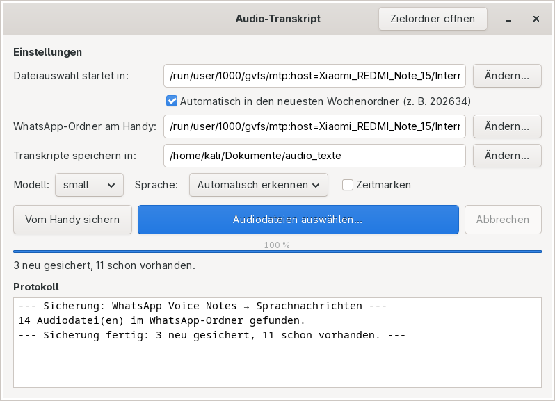
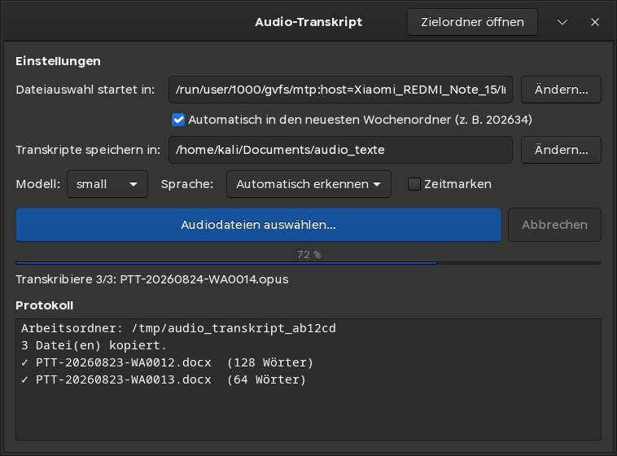

# Audio-Transkript

Kleine GTK3-Anwendung für Linux, die Audiodateien (WhatsApp-Sprachnachrichten, MP3, WAV …)
lokal in Text umwandelt und als `.docx` speichert — direkt in OnlyOffice zu öffnen.

Die Transkription läuft vollständig offline mit [faster-whisper](https://github.com/SYSTRAN/faster-whisper).
Es werden keine Audiodaten ins Internet geladen. Nur das Sprachmodell wird beim ersten Start
einmalig heruntergeladen.

| Hell | Dunkel |
|---|---|
|  |  |

Das Fenster übernimmt automatisch das Desktop-Design — bei einem dunklen Mint-Theme
erscheint die Anwendung ebenfalls dunkel.

## Installation

```bash
git clone <repo-url> mp3_translator
cd mp3_translator
./setup.sh
```

`setup.sh` installiert die Systempakete (ffmpeg, GTK3, PyGObject), legt ein venv in `.venv` an,
installiert die Python-Pakete und richtet „Audio-Transkript" im Anwendungsmenü **und als Symbol
auf dem Schreibtisch** ein.

Optionen:

| Option | Wirkung |
|---|---|
| `--no-system-deps` | Systempakete überspringen (wenn schon vorhanden) |
| `--no-desktop-icon` | Kein Symbol auf dem Schreibtisch anlegen |
| `--prefetch [modell]` | Sprachmodell sofort herunterladen (Standard `small`) |

Das Schreibtisch-Symbol wird ausführbar gesetzt und per `gio set … metadata::trusted true`
als vertrauenswürdig markiert. Zeigt der Dateimanager es trotzdem als nicht startbar an:
Rechtsklick → „Starten erlauben".

Benötigt Python 3.10 oder neuer. Getestet auf Linux Mint (apt) und Arch/Garuda (pacman);
dnf und zypper werden ebenfalls erkannt. Schlägt die Paketinstallation fehl, obwohl alles
Nötige vorhanden ist, hilft `./setup.sh --no-system-deps`.

## Benutzung

Start über das Symbol auf dem Schreibtisch, das Anwendungsmenü oder `./run.sh`.

1. **WhatsApp-Ordner am Handy** — Quelle für „Vom Handy sichern", siehe unten.
2. **Audiodateien liegen in** — fester Ordner `audio_dateien` im Dokumentenordner des Systems
   (auf deutschen Systemen also `~/Dokumente/audio_dateien`). Dort landet alles, was „Vom Handy
   sichern" holt, und dort öffnet auch der Dateidialog. Der Knopf „Öffnen" zeigt ihn im Dateimanager.
3. **Transkripte speichern in** — Zielordner, standardmäßig `audio_texte` im
   Dokumentenordner des Systems (auf deutschen Systemen also `~/Dokumente/audio_texte`).
4. **Modell / Sprache / Zeitmarken** — siehe unten.
5. **Audiodateien auswählen…** — Mehrfachauswahl möglich; die Transkription startet sofort.

Ausgewählte Dateien werden zuerst nach `~/Dokumente/audio_dateien` kopiert und von dort verarbeitet.
Das Handy kann also direkt nach dem Kopieren abgesteckt werden. Anders als früher bleiben die
Audiodateien dort liegen — nur die 16-kHz-Zwischendateien landen in `/tmp` und werden gelöscht.
Dateien, die bereits in `audio_dateien` liegen, werden nicht noch einmal kopiert.

### Schon transkribierte Dateien werden übersprungen

Vor jedem Lauf liest das Programm die vorhandenen `.docx` im Zielordner (samt Unterordnern) und
vergleicht die dort in der Kopfzeile vermerkte **Quelle** mit den ausgewählten Dateien. Was schon
einmal transkribiert wurde, wird übersprungen und im Protokoll mit `⏭` samt Namen des vorhandenen
Transkripts vermerkt. Man kann also gefahrlos den ganzen Ordner markieren — es läuft nur das Neue.

Soll eine Datei doch noch einmal transkribiert werden (z. B. mit einem größeren Modell), muss das
alte Transkript vorher aus dem Zielordner entfernt oder verschoben werden.

### Vom Handy sichern

WhatsApp löscht Sprachnachrichten nach etwa einer Woche aus seinem Medienordner. Der Knopf
**„Vom Handy sichern"** kopiert sie vorher in Sicherheit: er durchsucht den eingestellten
WhatsApp-Ordner samt aller Wochenordner (`202634`, `202635`, …) und legt jede Audiodatei
flach in `~/Dokumente/audio_dateien` ab.

- Bereits vorhandene Dateien werden übersprungen — der Knopf lässt sich also täglich drücken,
  ohne Dubletten zu erzeugen.
- Eine Datei, die beim letzten Mal unvollständig ankam, wird erkannt und erneut geholt.
- Eine gleichnamige, aber inhaltlich andere Aufnahme überschreibt die vorhandene nicht,
  sondern wird durchgezählt abgelegt (`PTT-… (2).opus`).
- Der Lauf zeigt Fortschritt und lässt sich mit „Abbrechen" stoppen.

Quelle ist üblicherweise:

```
Android/media/com.whatsapp/WhatsApp/Media/WhatsApp Voice Notes
```

Der Zielordner liegt immer auf dem PC, jede Datei wandert also genau einmal über das Kabel.

### Benennung der Transkripte

Jede Audiodatei ergibt **ein eigenes** `.docx`, benannt nach dem Aufnahmedatum: `14.07.2026.docx`.
Mehrere Aufnahmen vom selben Tag werden durchgezählt (`14.07.2026 (2).docx`); bestehende Dateien
werden nie überschrieben. Der ursprüngliche Dateiname steht in der Kopfzeile des Dokuments
unter „Quelle".

Das Datum wird in dieser Reihenfolge ermittelt:

1. **Dateiname** — WhatsApp kodiert das Datum bereits dort: `PTT-20260714-WA0002.opus` → 14.07.2026.
   Ebenso erkannt: `2026-07-14 …`. Unplausible Treffer (Zukunft, 30. Februar, reine Zufallszahlen)
   werden verworfen.
2. **Metadaten** — `creation_time` im Container, z. B. bei `.m4a` vom iPhone.
   WhatsApp-`.opus`-Dateien haben keine Tags, daher greift hier meist Schritt 1 oder 3.
3. **Änderungsdatum** der Originaldatei. Der Zeitstempel bleibt beim Kopieren erhalten.

### Modelle

| Modell | Größe | Tempo (CPU) | Deutsche Qualität |
|---|---|---|---|
| `tiny` | ~75 MB | sehr schnell | schwach |
| `base` | ~150 MB | schnell | mäßig |
| `small` | ~500 MB | ~1–2× Echtzeit | gut (Standard) |
| `medium` | ~1,5 GB | ~3–5× Echtzeit | sehr gut |
| `large-v3` | ~3 GB | ~10× Echtzeit | am besten |

Modelle landen im Cache unter `~/.cache/huggingface`.

### Handy anschließen (MTP)

Handy per USB verbinden und am Gerät **Dateiübertragung/MTP** auswählen (Bildschirm entsperrt
lassen). Das Gerät erscheint dann in der Seitenleiste des Dateidialogs; der Pfad liegt unter
`/run/user/1000/gvfs/mtp:host=…`.

WhatsApp-Sprachnachrichten liegen typischerweise unter:

```
Interner gemeinsamer Speicher/Android/media/com.whatsapp/WhatsApp/Media/WhatsApp Voice Notes/<JJJJWW>/
```

Bei mehreren WhatsApp-Konten zusätzlich unter `…/WhatsApp/accounts/<id>/Media/WhatsApp Voice Notes/`.

## Einstellungen

Gespeichert in `~/.config/audio-transkript/config.json`. Bei defektem Inhalt greifen
automatisch die Standardwerte.

Optionale Umgebungsvariablen:

| Variable | Standard | Bedeutung |
|---|---|---|
| `AUDIO_TRANSKRIPT_DEVICE` | `cpu` | `cuda` oder `auto` für NVIDIA-GPU |
| `AUDIO_TRANSKRIPT_COMPUTE` | `int8` (CPU) | z. B. `float16`, `int8_float16` |

## Fehlerbehebung

| Problem | Ursache / Lösung |
|---|---|
| „ffmpeg wurde nicht gefunden" | `sudo apt install ffmpeg` |
| „PyGObject/GTK3 fehlt" | `sudo apt install python3-gi gir1.2-gtk-3.0`, danach `./setup.sh` |
| Handy nicht im Dateidialog | `sudo apt install gvfs-backends`, Handy entsperren, MTP-Modus wählen |
| „Datei nicht direkt lesbar" beim Auswählen | `sudo apt install gvfs-fuse`, danach Handy neu anstecken |
| Start über das Symbol tut nichts | Fehlermeldung erscheint jetzt als Dialog; Details in `~/.cache/audio-transkript.log` |
| „Kopie unvollständig" | Übertragung vom Gerät abgebrochen — Kabel prüfen und Datei erneut auswählen |
| „Audio konnte nicht dekodiert werden" | Datei ist beschädigt oder kein Audio |
| Erster Start dauert lange | Einmaliger Modell-Download; mit `./setup.sh --prefetch` vorab holen |
